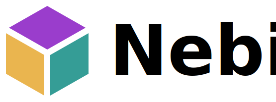
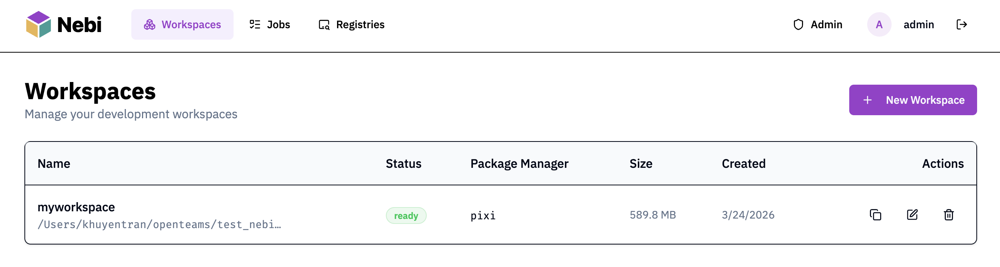

# Nebi

<div align="center">
  
</div>

<p align="center">
  Multi-user environment management for Pixi
</p>

<p align="center">
  <a href="https://github.com/nebari-dev/nebi/actions/workflows/ci.yml">
    
  </a>
  <a href="https://github.com/nebari-dev/nebi/blob/main/LICENSE">
    
  </a>
  <a href="https://github.com/nebari-dev/nebi/releases">
    
  </a>
  <a href="https://github.com/nebari-dev/nebi/issues">
    
  </a>
  <a href="https://github.com/nebari-dev/nebi/pulls">
    
  </a>
</p>

---

> **⚠️ Alpha Software**: Nebi is currently in alpha. APIs, UI, CLI and available features may change without notice. Not recommended for production use.


## What is Nebi?

If your Python projects need compiled libraries like GDAL or CUDA, you know `pip install` often isn't enough. [Pixi](https://pixi.sh) solves that by managing both Python packages and system libraries in one lockfile.

Nebi builds on Pixi to add what teams need: version history, rollback, sharing environments through registries, and access control over who can change production dependencies.

**Key features:**

- Install system libraries alongside Python packages (via Pixi)
- Push, pull, and diff versioned environments across machines
- Share environments through OCI registries (Quay.io, GHCR, etc.)
- Roll back when a dependency update breaks your workflow
- Control who can modify shared environments with role-based access
- Activate any workspace by name from any directory

## Quick Start

### Quick Install

**Linux / macOS:**
```sh
curl -fsSL https://nebi.nebari.dev/install.sh | sh
```

**Windows (PowerShell):**
```powershell
irm https://nebi.nebari.dev/install.ps1 | iex
```

See `install.sh --help` or the script source for advanced options (`--version`, `--install-dir`, `--desktop`).

### CLI Quick Start

#### Set up

Start a local Nebi server (set your own admin credentials):

```bash
export ADMIN_USERNAME=admin
export ADMIN_PASSWORD=your-password
nebi serve
```

This starts the Nebi server at [http://localhost:8460](http://localhost:8460).

In a new terminal, connect the CLI to the server:

```bash
nebi login http://localhost:8460
```

#### Track and push your environment

Initialize nebi in your project:

```bash
cd my-project
nebi init
```

Push your environment to the server:

```bash
nebi push myworkspace
```

Or tag a specific version:

```bash
nebi push myworkspace:v1.0
```

Once pushed, your workspace appears on the server dashboard:



#### Pull on another machine

Pull an environment on another machine:

```bash
nebi pull myworkspace:v1.0
```

Verify what version you're running with `nebi status`:

```bash
nebi status
```

```text
Workspace: myworkspace
Path:      /Users/you/my-project
Server:    http://localhost:8460
Origin:    myworkspace:v1.0 (pull)
```

## Documentation

- [CLI Guide](https://nebi.nebari.dev/docs/cli-guide) - Full CLI usage and workflows
- [CLI Reference](https://nebi.nebari.dev/docs/cli-reference) - All commands and flags
- [Server Setup](https://nebi.nebari.dev/docs/server-setup) - Configuration and environment variables
- [Architecture](https://nebi.nebari.dev/docs/architecture) - How the CLI, server, and OCI registries fit together

API documentation is available at `/docs` on any running Nebi server (e.g. `http://localhost:8460/docs`).

## Contributing

See [CONTRIBUTING.md](CONTRIBUTING.md) for development setup, build instructions, and project structure.

