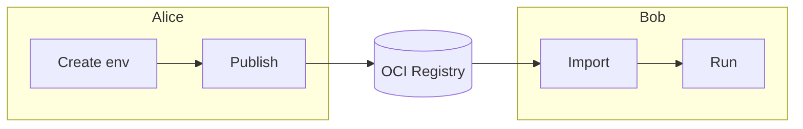

# Share and Reuse Environments

Your coworker is starting a new project but needs the same environment you've been using. They're on a different machine, maybe even a different OS. How do you share your exact setup with them?

This example walks through the full publish-and-consume workflow: **Alice** creates and publishes an environment, and **Bob** downloads and runs it with no manual setup needed.

Here's a visual overview of the workflow:



## What You'll Need

- [Nebi CLI installed](../installation.md)
- [Pixi](https://pixi.sh) installed
- Access to a Nebi server (see [Server Setup](../server-setup.md))
- A configured OCI registry (see [Registry Setup](../registry-setup.md))

## Alice: Create and Publish the Environment

:::info Follow along
Clone the example to follow along with this tutorial:

```bash
git clone https://github.com/nebari-dev/nebi.git
cd nebi/docs/examples/data-science-demo
nebi init
```

:::

### Step 1: Create the workspace

Alice creates a data science environment with Python, scikit-learn, and Streamlit. Here's her `pixi.toml`:

```toml
[workspace]
name = "data-science-demo"
channels = ["conda-forge"]
platforms = ["linux-64", "linux-aarch64", "osx-arm64", "osx-64"]
version = "0.1.0"

[dependencies]
python = ">=3.11"
scikit-learn = ">=1.4"
streamlit = ">=1.30"
```

### Step 2: Add tasks

Alice adds a training task directly in `pixi.toml`. Since the task is defined inline, it travels with the environment when published:

```toml
[tasks]
train = """python -c "
from sklearn.datasets import load_iris
from sklearn.tree import DecisionTreeClassifier
from sklearn.model_selection import train_test_split
from sklearn.metrics import accuracy_score, confusion_matrix

X, y = load_iris(return_X_y=True)
X_train, X_test, y_train, y_test = train_test_split(X, y, test_size=0.3, random_state=42)

model = DecisionTreeClassifier(random_state=42)
model.fit(X_train, y_train)

y_pred = model.predict(X_test)
print(f'Accuracy: {accuracy_score(y_test, y_pred):.2f}')
cm = confusion_matrix(y_test, y_pred)
print('Confusion Matrix:')
print(cm)
" """
```

She also adds a Streamlit app for interactive predictions:

```toml
app = """python -c "
import tempfile, os, subprocess, sys
code = '''
import streamlit as st
from sklearn.datasets import load_iris
from sklearn.tree import DecisionTreeClassifier

iris = load_iris()
model = DecisionTreeClassifier(random_state=42)
model.fit(iris.data, iris.target)

st.title('Iris Species Predictor')
features = [[
    st.slider('Sepal length', 4.0, 8.0, 5.8),
    st.slider('Sepal width', 2.0, 4.5, 3.0),
    st.slider('Petal length', 1.0, 7.0, 4.0),
    st.slider('Petal width', 0.1, 2.5, 1.2),
]]
st.subheader(f'Predicted: {iris.target_names[model.predict(features)[0]]}')
'''
f = tempfile.NamedTemporaryFile(suffix='.py', delete=False, mode='w')
f.write(code)
f.close()
subprocess.run([sys.executable, '-m', 'streamlit', 'run', f.name])
os.unlink(f.name)
" """
```

Alice can verify the tasks work locally by running the training task:

```bash
pixi run train
```

```bash title="Output"
Accuracy: 1.00
Confusion Matrix:
[[19  0  0]
 [ 0 13  0]
 [ 0  0 13]]
```

Or launch the Streamlit app:

```bash
pixi run app
```


### Step 3: Push to the Nebi server

Once satisfied with the results, Alice logs in to the Nebi server. The URL depends on your deployment (see [Server Setup](../server-setup.md)):

```bash
nebi login http://localhost:8460
```

Then pushes her workspace:

```bash
nebi push data-science-demo:v1.0
```

```bash title="Output"
Creating workspace "data-science-demo"...
Created workspace "data-science-demo"
Pushing data-science-demo:v1.0...
```

Both `pixi.toml` and `pixi.lock` are now stored on the server, tagged as `v1.0`.

### Step 4: Publish to an OCI registry

Bob works at a different company and can't log in to Alice's Nebi server. By publishing to a public OCI registry, Alice lets Bob import the environment with a single command, no server access needed.

The `--tag` sets the version and `--repo` names the repository on the registry:

```bash
nebi publish data-science-demo --tag v1.0 --repo data-science-demo
```

```bash title="Output"
Published data-science-demo:v1.0
```

## Bob: Download and Run the Environment

Bob doesn't need to know what packages Alice chose or how the environment was built. He just needs one command.

### Option A: Import from the OCI registry

If Bob doesn't have access to Alice's Nebi server, he can import directly from the OCI registry:

```bash
nebi import <registry-url>/data-science-demo:v1.0 -o data-science-demo
```

Replace `<registry-url>` with the registry Alice published to (e.g., `quay.io/alice` or `ghcr.io/alice`).

This creates a `data-science-demo` directory with the environment files:

```bash title="Output"
data-science-demo/
├── pixi.toml
└── pixi.lock
```

### Option B: Pull from the Nebi server

If Bob has access to the same Nebi server, he can pull the workspace directly:

```bash
nebi login http://localhost:8460
nebi pull data-science-demo:v1.0 -o ./data-science-demo
```

```bash title="Output"
Pulled data-science-demo:v1.0
```

### Run the task

Either way, Bob now has the full environment and the tasks Alice defined. He can run the training task:

```bash
cd data-science-demo
pixi run train
```

```bash title="Output"
Accuracy: 1.00
Confusion Matrix:
[[19  0  0]
 [ 0 13  0]
 [ 0  0 13]]
```

Or launch the Streamlit app:

```bash
pixi run app
```

Bob gets the same packages, the same versions, and the same results as Alice.

## What Just Happened

Here's the full flow at a glance:

| Step | Who | Command |
|------|-----|---------|
| Create workspace | Alice | `nebi init` + `pixi add` |
| Add tasks | Alice | Edit `pixi.toml` |
| Push to server | Alice | `nebi push` |
| Publish to OCI | Alice | `nebi publish` |
| Import environment | Bob | `nebi import` |
| Run task | Bob | `pixi run train` |

With nebi, Alice's exact environment lands on Bob's machine without manual setup.