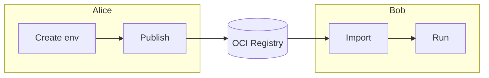

# Share and Reuse Environments

You've built a data science environment with the exact packages your project needs. A teammate wants to run the same analysis, but they're on a different machine, maybe even a different OS. How do you make sure they get the exact same setup?

This example walks through the full publish-and-consume workflow: **Alice** creates and publishes an environment, and **Bob** downloads and runs it with no manual setup needed.

Here's a visual overview of the workflow:



## What You'll Need

- [Nebi CLI installed](../installation.md)
- [Pixi](https://pixi.sh) installed
- Access to a Nebi server (see [Server Setup](../server-setup.md))
- A configured OCI registry (see [Registry Setup](../registry-setup.md))

## Alice: Create and Publish the Environment

### Step 1: Create the workspace

Alice creates a data science environment with common packages like scikit-learn.

```bash
mkdir data-science-demo && cd data-science-demo
nebi init
```

```bash title="Output"
Workspace 'data-science-demo' initialized (/home/user/data-science-demo)
```

She adds the packages she needs:

```bash
pixi add python ">=3.11" scikit-learn ">=1.4"
```

The resulting `pixi.toml` looks like this:

```toml
[workspace]
name = "data-science-demo"
channels = ["conda-forge"]
platforms = ["linux-64", "linux-aarch64", "osx-arm64", "osx-64"]
version = "0.1.0"

[dependencies]
python = ">=3.11"
scikit-learn = ">=1.4"
```

:::tip
To create your own environment from scratch instead, run `nebi init` in an empty directory and use `pixi add` to add packages (e.g., `pixi add numpy pandas matplotlib`).
:::

### Step 2: Push to the Nebi server

Once satisfied with the results, Alice logs in to the Nebi server. The URL depends on your deployment (see [Server Setup](../server-setup.md)):

```bash
nebi login http://localhost:8460
```

Then pushes her workspace:

```bash
nebi push data-science-demo:v1.0
```

```bash title="Output"
Creating workspace "data-science-demo"...
Created workspace "data-science-demo"
Pushing data-science-demo:v1.0...
```

Both `pixi.toml` and `pixi.lock` are now stored on the server, tagged as `v1.0`.

### Step 3: Publish to an OCI registry

Bob works at a different company and can't log in to Alice's Nebi server. By publishing to a public OCI registry, Alice lets Bob import the environment with a single command, no server access needed.

The `--tag` sets the version and `--repo` names the repository on the registry:

```bash
nebi publish data-science-demo --tag v1.0 --repo data-science-demo
```

```bash title="Output"
Published data-science-demo:v1.0
```

## Bob: Download and Run the Environment

Bob doesn't need to know what packages Alice chose or how the environment was built. He just needs one command.

### Option A: Import from the OCI registry

If Bob doesn't have access to Alice's Nebi server, he can import directly from the OCI registry:

```bash
nebi import quay.io/your-username/data-science-demo:v1.0 -o data-science-demo
```

This creates a `data-science-demo` directory with the environment files:

```bash title="Output"
data-science-demo/
├── pixi.toml
└── pixi.lock
```

### Option B: Pull from the Nebi server

If Bob has access to the same Nebi server, he can pull the workspace directly:

```bash
nebi login http://localhost:8460
nebi pull data-science-demo:v1.0 -o ./data-science-demo
```

```bash title="Output"
Pulled data-science-demo:v1.0
```

### Verify the environment

Either way, Bob now has the full environment. He can verify it works by running a quick check:

```bash
cd data-science-demo
pixi run python -c "import sklearn; print(f'scikit-learn {sklearn.__version__} ready')"
```

```bash title="Output"
scikit-learn 1.8.0 ready
```

Pixi resolves and installs all dependencies from the lock file on first run. No manual `pip install`, no version conflicts, no "works on my machine."

## What Just Happened

Here's the full flow at a glance:

| Step | Who | Command |
|------|-----|---------|
| Create and init workspace | Alice | `nebi init` + `pixi add ...` |
| Push to server | Alice | `nebi push data-science-demo:v1.0` |
| Publish to OCI | Alice | `nebi publish data-science-demo --tag v1.0 --repo data-science-demo` |
| Import environment | Bob | `nebi import quay.io/your-username/data-science-demo:v1.0 -o data-science-demo` |
| Verify environment | Bob | `pixi run python -c "import sklearn; ..."` |

Alice's exact environment (every package, every version, every platform build) lands on Bob's machine, ready to use.

## Next Steps

- Browse available environments: `nebi workspace list --remote`
- Compare versions: `nebi diff data-science-demo:v1.0 data-science-demo:v2.0`
- See all CLI commands: [CLI Reference](../cli-reference.md)
