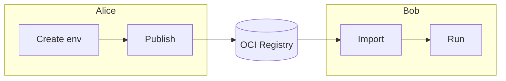

# Share and Reuse Environments

Your coworker is starting a new project but needs the same environment you've been using. They're on a different machine, maybe even a different OS. How do you share your exact setup with them?

This example walks through the full publish-and-consume workflow: **Alice** creates and publishes an environment, and **Bob** downloads and runs it with no manual setup needed.

Here's a visual overview of the workflow:



## What You'll Need

- [Nebi CLI installed](../installation.md)
- [Pixi](https://pixi.sh) installed
- A configured OCI registry (see [Registry Setup](../registry-setup.md))

## Alice: Create and Publish the Environment

:::info Follow along
Clone the example to follow along with this tutorial:

```bash
git clone https://github.com/nebari-dev/nebi.git
cd nebi/docs/examples/data-science-demo
nebi init
```

:::

### Step 1: Create the workspace

Alice creates a data science environment with Python, scikit-learn, and Streamlit. Here's her `pixi.toml`:

```toml
[workspace]
name = "data-science-demo"
channels = ["conda-forge"]
platforms = ["linux-64", "linux-aarch64", "osx-arm64", "osx-64"]
version = "0.1.0"

[dependencies]
python = ">=3.11"
scikit-learn = ">=1.4"
streamlit = ">=1.30"
```

### Step 2: Add code and tasks

Alice writes the training code in `train.py`:

```python title="train.py"
from sklearn.datasets import load_iris
from sklearn.tree import DecisionTreeClassifier
from sklearn.model_selection import train_test_split
from sklearn.metrics import accuracy_score, confusion_matrix

X, y = load_iris(return_X_y=True)
X_train, X_test, y_train, y_test = train_test_split(
    X, y, test_size=0.3, random_state=42
)

model = DecisionTreeClassifier(random_state=42)
model.fit(X_train, y_train)

y_pred = model.predict(X_test)
print(f"Accuracy: {accuracy_score(y_test, y_pred):.2f}")
cm = confusion_matrix(y_test, y_pred)
print("Confusion Matrix:")
print(cm)
```

And a Streamlit app for interactive predictions in `app.py`:

```python title="app.py"
import streamlit as st
from sklearn.datasets import load_iris
from sklearn.tree import DecisionTreeClassifier

iris = load_iris()
model = DecisionTreeClassifier(random_state=42)
model.fit(iris.data, iris.target)

st.title("Iris Species Predictor")
features = [
    [
        st.slider("Sepal length", 4.0, 8.0, 5.8),
        st.slider("Sepal width", 2.0, 4.5, 3.0),
        st.slider("Petal length", 1.0, 7.0, 4.0),
        st.slider("Petal width", 0.1, 2.5, 1.2),
    ]
]
st.subheader(f"Predicted: {iris.target_names[model.predict(features)[0]]}")
```

Alice wires the scripts up as named tasks in `pixi.toml` so they can be run with a short command (`pixi run train`, `pixi run app`):

```toml
[tasks]
train = "python train.py"
app = "streamlit run app.py"
```

Alice installs the environment to generate the lock file:

```bash
pixi install
```

This creates `pixi.lock`, which pins the exact package versions for reproducibility.

She can then verify the tasks work locally by running the training task:

```bash
pixi run train
```

```bash title="Output"
Accuracy: 1.00
Confusion Matrix:
[[19  0  0]
 [ 0 13  0]
 [ 0  0 13]]
```

Or launch the Streamlit app:

```bash
pixi run app
```


Alice's workspace now looks like this:

```text
.
├── README.md
├── app.py
├── pixi.lock
├── pixi.toml
└── train.py
```

### Step 3: Publish to an OCI registry

Before publishing, configure a default registry (see [Registry Setup](../registry-setup.md) for details):

```bash
nebi registry add \
  --default \
  --name <name> \
  --url <url> \
  --namespace <namespace> \
  --username <username>
```

For example, here's how it looks with Docker Hub:

```bash
nebi registry add \
  --name dockerhub \
  --url docker.io \
  --namespace alice \
  --username alice \
  --default
Password:
Added local registry 'dockerhub' (docker.io)
```

Then publish. The `--tag` sets the version and `--repo` names the repository:

```bash
nebi publish data-science-demo --tag v1.0 --repo data-science-demo
```

Example output with Docker Hub:

```bash title="Output"
Published docker.io/alice/data-science-demo:v1.0 (digest: sha256:...)
```

The bundle now lives at `docker.io/alice/data-science-demo:v1.0` and contains every file from Alice's workspace: `pixi.toml`, `pixi.lock`, `train.py`, `app.py`, `README.md`.

## Bob: Download and Run the Environment

Bob doesn't need to know what packages Alice chose or how the environment was built. He just needs one command.

### Import from the OCI registry

To recreate Alice's environment locally, Bob just needs to import the bundle:

```bash
nebi import <url>/<namespace>/data-science-demo:v1.0
```

For example, with Alice's Docker Hub registry, the command would be:

```bash
nebi import docker.io/alice/data-science-demo:v1.0
```

This restores all of Alice's workspace files into the current directory at their original relative paths:

```text
.
├── README.md
├── app.py
├── pixi.lock
├── pixi.toml
└── train.py
```

### Run the task

Now that Bob has the environment, he can run the training task:

```bash
pixi run train
```

```bash title="Output"
Accuracy: 1.00
Confusion Matrix:
[[19  0  0]
 [ 0 13  0]
 [ 0  0 13]]
```

Or launch the Streamlit app:

```bash
pixi run app
```

## What Just Happened

Here's the full flow at a glance:

| Step | Who | Command |
|------|-----|---------|
| Create workspace | Alice | `nebi init` + `pixi add` |
| Add tasks | Alice | Edit `pixi.toml` |
| Publish to OCI | Alice | `nebi publish` |
| Import environment | Bob | `nebi import` |
| Run task | Bob | `pixi run train` |

With Nebi, Bob gets the same packages, the same versions, the same project files, and the same results as Alice without any manual setup.
