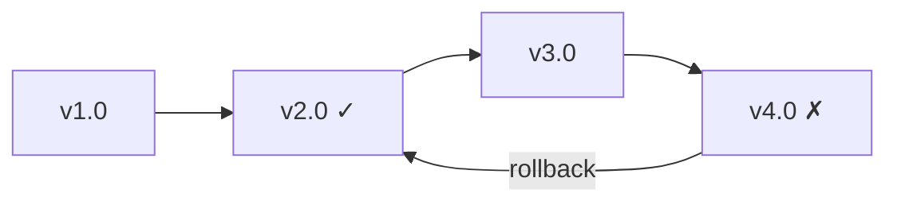

# Version Rollback

Imagine this scenario: your latest environment update broke your team's pipeline. You know version 2.0 was working fine last week. How do you get everyone back to that version quickly?

This example walks through versioning and rollback: **Alice** publishes multiple versions of an environment, discovers a problem, and rolls back to a known good version.



## What You'll Need

- [Nebi CLI installed](../installation.md)
- [Pixi](https://pixi.sh) installed
- Access to a Nebi server (see [Server Setup](../server-setup.md))

## Step 1: Create and push the initial version

Alice creates an environment with scikit-learn and a training task.

:::info Follow along
Clone the example to follow along with this tutorial:

```bash
git clone https://github.com/nebari-dev/nebi.git
cd nebi/docs/examples/ml-pipeline
nebi init
```

:::

Here's her `pixi.toml`:

```toml
[workspace]
name = "ml-pipeline"
channels = ["conda-forge"]
platforms = ["linux-64", "linux-aarch64", "osx-arm64", "osx-64"]
version = "0.1.0"

[dependencies]
python = ">=3.11"
scikit-learn = ">=1.4"

[tasks]
train = """python -c "
from sklearn.datasets import load_iris
from sklearn.tree import DecisionTreeClassifier
from sklearn.model_selection import train_test_split
from sklearn.metrics import accuracy_score

X, y = load_iris(return_X_y=True)
X_train, X_test, y_train, y_test = train_test_split(X, y, test_size=0.3, random_state=42)

model = DecisionTreeClassifier(random_state=42)
model.fit(X_train, y_train)

y_pred = model.predict(X_test)
print(f'Accuracy: {accuracy_score(y_test, y_pred):.2f}')
" """
```

After creating the environment, Alice runs the training task to verify it works:

```bash
pixi run train
```

```bash title="Output"
Accuracy: 1.00
```

Then pushes it to the server as `v1.0`:

```bash
nebi login http://localhost:8460
nebi push ml-pipeline:v1.0
```

## Step 2: Push more versions

Over the next few weeks, Alice updates the environment. Each push creates a new tagged version on the server.

**v2.0** adds pandas for data exploration:

```bash
pixi add "pandas>=2.2"
nebi push ml-pipeline:v2.0
```

**v3.0** updates the train task to load data from a CSV file instead of the built-in dataset:

Alice edits the `train` task in `pixi.toml` to use pandas:

```toml
train = """python -c "
import pandas as pd
from sklearn.tree import DecisionTreeClassifier
from sklearn.model_selection import train_test_split
from sklearn.metrics import accuracy_score

df = pd.read_csv('data.csv')
X, y = df.drop('target', axis=1), df['target']
X_train, X_test, y_train, y_test = train_test_split(X, y, test_size=0.3, random_state=42)

model = DecisionTreeClassifier(random_state=42)
model.fit(X_train, y_train)

y_pred = model.predict(X_test)
print(f'Accuracy: {accuracy_score(y_test, y_pred):.2f}')
" """
```

```bash
nebi push ml-pipeline:v3.0
```

**v4.0** adds matplotlib for plotting:

```bash
pixi add "matplotlib>=3.8"
nebi push ml-pipeline:v4.0
```

## Step 3: Discover the problem

A teammate pulls the latest version and runs the training task:

```bash
pixi run train
```

```bash title="Output"
FileNotFoundError: [Errno 2] No such file or directory: 'data.csv'
```

The task fails because v3.0 changed it to read from a CSV file that doesn't exist.

To figure out which version introduced the broken task, Alice looks at the version history:

```bash
nebi workspace tags ml-pipeline
```

```bash title="Output"
TAG   VERSION  CREATED
v4.0  5        2026-04-01 03:01
v3.0  4        2026-04-01 03:01
v2.0  3        2026-04-01 03:00
v1.0  2        2026-04-01 03:00
```

To narrow it down, Alice compares each pair of consecutive versions:

```bash
nebi diff ml-pipeline:v3.0 ml-pipeline:v4.0
```

```bash title="Output"
--- ml-pipeline:v3.0
+++ ml-pipeline:v4.0
@@ pixi.toml @@
 [dependencies]
+matplotlib = ">=3.8"
```

No task changes, just a new package. She checks the previous pair:

```bash
nebi diff ml-pipeline:v2.0 ml-pipeline:v3.0
```

```bash title="Output"
--- ml-pipeline:v2.0
+++ ml-pipeline:v3.0
@@ pixi.toml @@
 [tasks]
-train = "python -c \"\nfrom sklearn.datasets import load_iris\nfrom sklearn.tree import DecisionTreeClassifier\nfrom sklearn.model_selection import train_test_split\nfrom sklearn.metrics import accuracy_score\n\nX, y = load_iris(return_X_y=True)\nX_train, X_test, y_train, y_test = train_test_split(X, y, test_size=0.3, random_state=42)\n\nmodel = DecisionTreeClassifier(random_state=42)\nmodel.fit(X_train, y_train)\n\ny_pred = model.predict(X_test)\nprint(f'Accuracy: {accuracy_score(y_test, y_pred):.2f}')\n\" "
+train = "python -c \"\nimport pandas as pd\nfrom sklearn.tree import DecisionTreeClassifier\nfrom sklearn.model_selection import train_test_split\nfrom sklearn.metrics import accuracy_score\n\ndf = pd.read_csv('data.csv')\nX = df.drop('target', axis=1)\ny = df['target']\nX_train, X_test, y_train, y_test = train_test_split(X, y, test_size=0.3, random_state=42)\n\nmodel = DecisionTreeClassifier(random_state=42)\nmodel.fit(X_train, y_train)\n\ny_pred = model.predict(X_test)\nprint(f'Accuracy: {accuracy_score(y_test, y_pred):.2f}')\n\" "
```

There it is. The train task in v3.0 reads from data.csv instead of the built-in dataset. Alice now knows to roll back to v2.0.

## Step 4: Roll back

Alice rolls back by pulling the last known good version:

```bash
nebi pull ml-pipeline:v2.0
```

```bash title="Output"
Pulled ml-pipeline:v2.0
```

This replaces the local `pixi.toml` and `pixi.lock` with the `v2.0` spec. To verify that the task works again, Alice runs it:

```bash
pixi run train
```

```bash title="Output"
Accuracy: 1.00
```

The environment is now back to a working state!

## Step 5: Roll back on the server

To restore the working version, Alice opens the Nebi UI, expands the version tagged `v2.0`, and clicks **Rollback to This Version**:


This creates a new version marked as **Current**, with the same content as v2.0:


The team can now pull the latest version to get the working environment:

```bash
nebi pull ml-pipeline
```

## What Just Happened

Here's the full flow at a glance:

| Step                 | Command                                |
|----------------------|----------------------------------------|
| Push initial version | `nebi push :v1.0`                      |
| Push updates         | `nebi push :v2.0`, `:v3.0`, `:v4.0`   |
| View version history | `nebi workspace tags`                  |
| Compare versions     | `nebi diff :v2.0 :v4.0`               |
| Roll back on server  | Nebi UI rollback button                |
| Pull working version | `nebi pull`                            |

With nebi, every push is versioned and tagged. Rolling back is one click in the UI.

## Next Steps

- See all CLI commands: [CLI Reference](../cli-reference.md)
