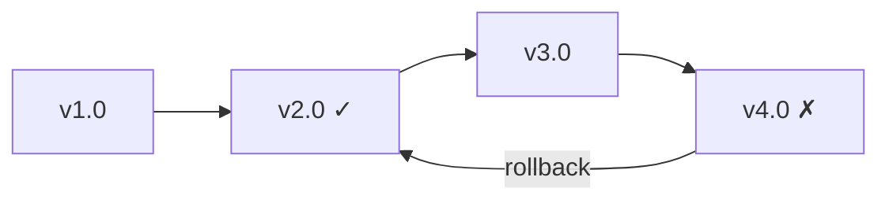

# Version Rollback

Imagine this scenario: your latest environment update broke your team's pipeline. You know version 2.0 was working fine last week. How do you get everyone back to that version quickly?

This example walks through versioning and rollback: **Alice** publishes multiple versions of an environment, discovers a problem, and rolls back to a known good version.



## What You'll Need

- [Nebi CLI installed](../installation.md)
- [Pixi](https://pixi.sh) installed
- Access to a Nebi server (see [Server Setup](../server-setup.md))

## Step 1: Create and push the initial version

Alice creates an environment with scikit-learn and a training task.

:::info Follow along
Clone the example to follow along with this tutorial:

```bash
git clone https://github.com/nebari-dev/nebi.git
cd nebi/docs/examples/ml-pipeline
nebi init
```

:::

Here's her `pixi.toml`:

```toml
[workspace]
name = "ml-pipeline"
channels = ["conda-forge"]
platforms = ["linux-64", "linux-aarch64", "osx-arm64", "osx-64"]
version = "0.1.0"

[dependencies]
python = ">=3.11"
scikit-learn = ">=1.4"

[tasks]
train = """python -c "
from sklearn.datasets import load_iris
from sklearn.tree import DecisionTreeClassifier
from sklearn.model_selection import train_test_split
from sklearn.metrics import accuracy_score

X, y = load_iris(return_X_y=True)
X_train, X_test, y_train, y_test = train_test_split(X, y, test_size=0.3, random_state=42)

model = DecisionTreeClassifier(random_state=42)
model.fit(X_train, y_train)

y_pred = model.predict(X_test)
print(f'Accuracy: {accuracy_score(y_test, y_pred):.2f}')
" """
```

After creating the environment, Alice runs the training task to verify it works:

```bash
pixi run train
```

```bash title="Output"
Accuracy: 1.00
```

Then pushes it to the server as `v1.0`:

```bash
nebi login http://localhost:8460
nebi push ml-pipeline:v1.0
```

## Step 2: Push more versions

Over the next few weeks, Alice updates the environment. Each push creates a new tagged version on the server.

**v2.0** adds pandas for data exploration:

```bash
pixi add "pandas>=2.2"
nebi push ml-pipeline:v2.0
```

**v3.0** updates the train task to load data from a CSV file:

Alice edits the `train` task in `pixi.toml` to use pandas:

```toml
train = """python -c "
import pandas as pd
from sklearn.tree import DecisionTreeClassifier
from sklearn.model_selection import train_test_split
from sklearn.metrics import accuracy_score

df = pd.read_csv('data.csv')
X = df.drop('target', axis=1)
y = df['target']
X_train, X_test, y_train, y_test = train_test_split(X, y, test_size=0.3, random_state=42)

model = DecisionTreeClassifier(random_state=42)
model.fit(X_train, y_train)

y_pred = model.predict(X_test)
print(f'Accuracy: {accuracy_score(y_test, y_pred):.2f}')
" """
```

```bash
nebi push ml-pipeline:v3.0
```

**v4.0** adds matplotlib for plotting:

```bash
pixi add "matplotlib>=3.8"
nebi push ml-pipeline:v4.0
```

## Step 3: Discover the problem

A teammate pulls the latest version and runs the training task:

```bash
pixi run train
```

```bash title="Output"
FileNotFoundError: [Errno 2] No such file or directory: 'data.csv'
```

The task fails because v3.0 changed it to read from a CSV file that doesn't exist. Alice checks the version history to find the last working version:

```bash
nebi workspace tags ml-pipeline
```

```bash title="Output"
TAG     VERSION  CREATED
v4.0    4        2026-03-31 16:00
v3.0    3        2026-03-31 14:00
v2.0    2        2026-03-31 12:00
v1.0    1        2026-03-31 10:00
```

She compares her current environment against the last known good version:

```bash
nebi diff ml-pipeline:v2.0 ml-pipeline:v4.0
```

This shows exactly which packages were added or changed between the two versions.

## Step 4: Roll back

Alice rolls back by pulling the last known good version:

```bash
nebi pull ml-pipeline:v2.0
```

```bash title="Output"
Pulled ml-pipeline:v2.0
```

This replaces the local `pixi.toml` and `pixi.lock` with the `v2.0` spec. She verifies the training task works again:

```bash
pixi run train
```

```bash title="Output"
Accuracy: 1.00
```

The environment is back to a working state.

## Step 5: Push the fix

Alice pushes the rolled-back version as a new tag so the team knows which version to use:

```bash
nebi push ml-pipeline:v5.0-fixed
```

```bash title="Output"
Pushed ml-pipeline (version 2, tags: sha-..., latest, v5.0-fixed)
```

The team can now pull `v5.0-fixed` to get the working environment.

## What Just Happened

Here's the full flow at a glance:

| Step                 | Command                                |
|----------------------|----------------------------------------|
| Push initial version | `nebi push :v1.0`                      |
| Push updates         | `nebi push :v2.0`, `:v3.0`, `:v4.0`   |
| View version history | `nebi workspace tags`                  |
| Compare versions     | `nebi diff :v2.0 :v4.0`               |
| Roll back            | `nebi pull :v2.0`                      |
| Push the fix         | `nebi push :v5.0-fixed`               |

With nebi, every push is versioned and tagged. Rolling back is just pulling an older version.

## Next Steps

- See all CLI commands: [CLI Reference](../cli-reference.md)
